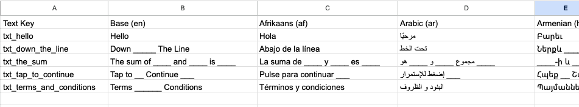
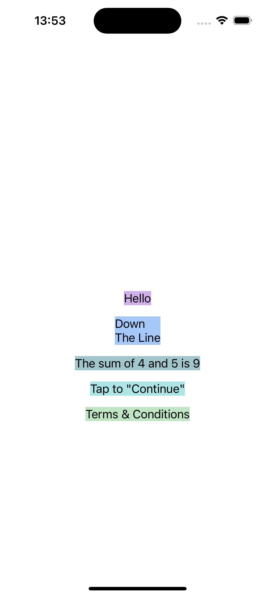

# MTLocalization

MTLocalization là tool được viết bằng python, tạo file `Localizable.xcstring`(String Catalog) cho Xcode.
Ngoài ra còn hỗ trợ tạo các file `Strings.xml` cho Android và `arb` cho Flutter.

## Cách sử dụng
- Bước 1: Mở file `Example/Data/res_example.xlsx` bằng Google Sheet. Thông qua tính năng tự dịch, nhập ngôn ngữ cần dịch ở cột `Base (en)` và điền case id ở cột Text Key. Nhớ chỉnh sửa lại nếu có sai format, vì không phải lúc nào google dịch cũng đúng.
- Bước 2: Tải file sheet vừa chỉnh sửa dưới dạng `.tsv` và đặt vào thư mục `res`.
- Bước 3. Mở project XcodeLocalization, mở file `xcode_translate.py` và chỉnh sửa thông tin: `INPUT_FILE_NAME` và `directoryParent` sau đó nhấn `RUN`
- Bước 4: Ở Xcode Project, kéo thư mục `Localization` vừa được tạo vào Project.
- Bước 5: Cách dùng xem `Example`
  (```MTText.txt_hello.localized```)
- Bước 6: Chạy project Xcode và fix bug. ^^

## Ví dụ:

```ruby
        let helloLabel = UILabel()
        helloLabel >>> view >>> {
            $0.snp.makeConstraints {
                $0.center.equalToSuperview()
            }
            $0.backgroundColor = .random.withAlphaComponent(0.39)
            $0.textColor = .black
            $0.numberOfLines = 0
            $0.text = MTText.txt_hello.localized
            
        }
        
        let downLineLabel = UILabel()
        downLineLabel >>> view >>> {
            $0.snp.makeConstraints {
                $0.top.equalTo(helloLabel.snp.bottom).offset(16)
                $0.centerX.equalToSuperview()
            }
            $0.backgroundColor = .random.withAlphaComponent(0.39)
            $0.textColor = .black
            $0.numberOfLines = 0
            $0.text = MTText.txt_down_the_line.localized
        }
        
        let theSumLabel = UILabel()
        theSumLabel >>> view >>> {
            $0.snp.makeConstraints {
                $0.top.equalTo(downLineLabel.snp.bottom).offset(16)
                $0.centerX.equalToSuperview()
            }
            $0.backgroundColor = .random.withAlphaComponent(0.39)
            $0.textColor = .black
            $0.numberOfLines = 0
            $0.text = MTText.txt_the_sum.format("4", "5", "\(4 + 5)")
        }
        
        let tapToContinueLabel = UILabel()
        tapToContinueLabel >>> view >>> {
            $0.snp.makeConstraints {
                $0.top.equalTo(theSumLabel.snp.bottom).offset(16)
                $0.centerX.equalToSuperview()
            }
            $0.backgroundColor = .random.withAlphaComponent(0.39)
            $0.textColor = .black
            $0.numberOfLines = 0
            $0.text = MTText.txt_tap_to_continue.localized
        }
        
        let termsAndConditionsLabel = UILabel()
        termsAndConditionsLabel >>> view >>> {
            $0.snp.makeConstraints {
                $0.top.equalTo(tapToContinueLabel.snp.bottom).offset(16)
                $0.centerX.equalToSuperview()
            }
            $0.backgroundColor = .random.withAlphaComponent(0.39)
            $0.textColor = .black
            $0.numberOfLines = 0
            $0.text = MTText.txt_terms_and_conditions.localized
        }
    }
```

**Data Mẫu:**




**Kết quả:**


